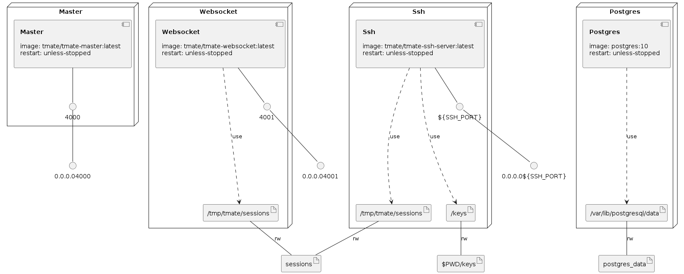

# setup

1.  pull images

    ```
    docker-compose pull
    ```

1.  edit example configuration

    ```
    cp ./tmate.env{.example,}
    cp ./email.env{.example,}
    ```

    preserve characterset and lengths of the secret key (except INTERNAL_API_AUTH_TOKEN);
    email configuration is mandatory only if you want to use named session capability

1.  generate keys

    ```
    mkdir -p keys && ./create_keys.sh
    ```

1.  configure tmate on the client:

    - either in `~/.tmate.conf` (as output of the script sugested),
    - or in `~/.tmux.conf` and then symlink `~/.tmate.conf` to `~/.tmux.conf`

1.  run migrations

    ```
    docker-compose up -d postgres
    docker-compose run master ./bin/tmate console

    # run comand twice
    Mix.Task.rerun("ecto.migrate", ["-r", Tmate.Repo, "--migrations-path", "./lib/tmate-0.1.1/priv/repo/migrations"])
    Mix.Task.rerun("ecto.migrate", ["-r", Tmate.Repo, "--migrations-path", "./lib/tmate-0.1.1/priv/repo/migrations"])

    # to exit type Ctrl+c followed by `a`
    ```

1.  launch services

    ```
    docker-compose up -d
    docker-compose logs -f
    ```


### Infrastructure model

